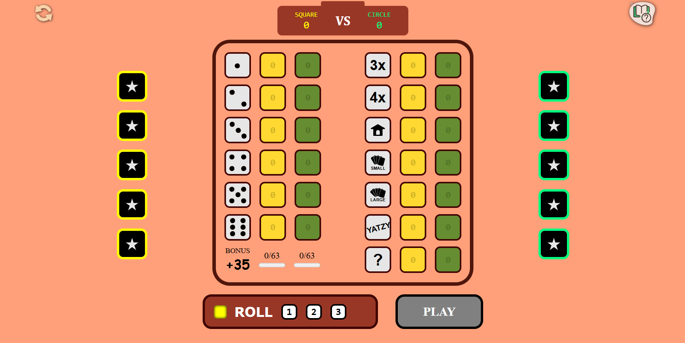

# 🎲 Yatzy – Two‑Player Dice Game

Two-player web-based Yatzy game built with React and PHP, featuring user accounts, persistent stats, and an interactive tutorial system.

## ✨ Features

- 🔄 Turn‑based gameplay (3 rolls per turn, lock dice)
- 📊 13 scoring categories + 35‑pt bonus
- 👤 User accounts (register / login) or guest play
- 📈 Persistent stats: wins, losses, draws, highest points, avg. points
- 🧭 Interactive tutorial (slides + hover tooltips)
- 🎨 Colour‑coded UI for each player

## 🧰 Tech Stack

### **Frontend:** React (Vite)  
### **Backend:** PHP 8+  
### **Database:** MySQL  

## ⚙️ Setup

### Clone & install frontend
```bash
git clone https://github.com/Okara008/yatzy-game.git
cd yatzy-game
npm install
npm run dev   # runs on http://localhost:5173
```
### Backend (XAMPP / MAMP)
- Copy PHP/ folder to htdocs/Yatzy/
- Import database.sql (see below)
- Update database.php with your DB credentials

### Database (MySQL)
```
CREATE TABLE `registered_players` (
  `id` INT AUTO_INCREMENT PRIMARY KEY,
  `username` VARCHAR(50) UNIQUE NOT NULL,
  `wins` INT DEFAULT 0,
  `losses` INT DEFAULT 0,
  `draws` INT DEFAULT 0,
  `highest_points` INT DEFAULT 0,
  `avg_points` DECIMAL(5,2) DEFAULT 0.00
);
```

🎮 How to Play
- Each player logs in (or uses Guest).
- Roll dice up to 3 times – click (or tap) dice to lock them.
- Select a scoring cell to preview points.
- Press PLAY to lock in that score.
- After all 13 cells are filled, the player with the highest score wins.

## 📦 Requirements
- Node.js (v18+ recommended)
- PHP 8+
- MySQL
- XAMPP or MAMP

## 📂 Project Structure
```
yatzy-game/
├── public/
├── src/
│   ├── assets/          # images, dice icons, svgs
│   ├── components/      # DiceRoller, Board, ScoreBoard, Winner, Login, etc.
│   ├── App.jsx
│   └── main.jsx
├── PHP/                 # Backend API files
│   ├── database.php
│   ├── api_send.php
│   ├── api_retrieve.php
│   ├── api_validate_user_exists.php
│   ├── api_game_outcome.php
│   └── api_retrieve_stats.php
├── README.md
└── package.json
```
## 🔗 API Endpoints

| Endpoint | Method | Description |
|----------|--------|-------------|
| `api_send.php` | POST | Create a new user |
| `api_retrieve.php` | POST | Retrieve user info (login) |
| `api_validate_user_exists.php` | POST | Check if username exists |
| `api_game_outcome.php` | POST | Update wins/losses/draws + high score |
| `api_retrieve_stats.php` | POST | Get player statistics |

## 📸 Screenshot
<p>
  
</p>

## 🚀 Live Demo
https://yatzy-game.vercel.app/

## 🚧 Future Improvements
- Online multiplayer (real-time)
- Mobile responsiveness improvements
- AI opponent mode

## 📄 License
MIT

Enjoy the game!
